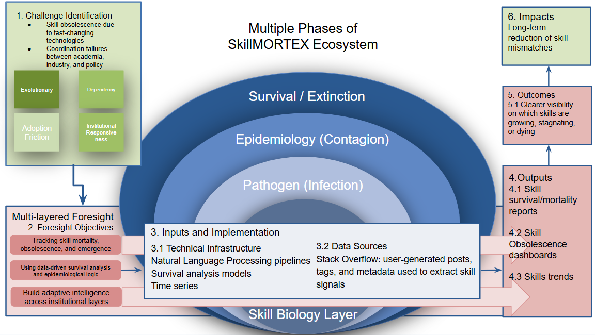
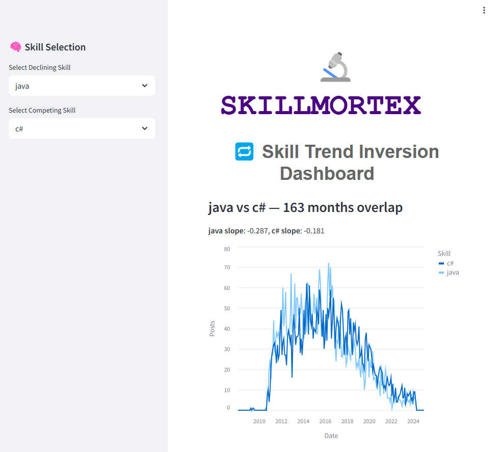

[](https://tsfel.readthedocs.io/en/latest/?badge=latest) [](https://opensource.org/licenses/MIT) 


# SkillMORTEX: Skill MORtality and EXtinction Ecosystem

**SkillMORTEX** is a research-driven framework for modeling the lifecycle of digital skills using techniques inspired by epidemiology and survival analysis. It leverages real-world usage data (e.g., from Stack Overflow) to identify skill birth, growth, decay, and eventual obsolescence.

---

## 📌 Project Overview

In today’s fast-paced digital labor market, skills emerge and disappear rapidly. This project proposes a biological and epidemiological metaphor to trace skill dynamics, identifying which technologies thrive, fade, or die out.

**Key concepts:**
- Skills as living entities within a digital ecosystem
- Weibull-based survival models for skill decay
- Epidemiological metrics (prevalence, incidence, mortality)
- Longitudinal trend analysis from 2008 to 2024

## 🔄 Cloning This Repository

This repository include more submodules (e.g., external skill taggers, models, or shared utilities). To clone both this repository and its submodules in one command, use:

```bash
git clone --recurse-submodules https://github.com/dkavargy/SkillMORTEX.git
```
Or use these three commands:

```bash
git clone https://github.com/dkavargy/SkillMORTEX.git
cd SkillMORTEX
git submodule update --init --recursive
```

---
## 🧠 SkillMORTEX Ecosystem Overview

The diagram below illustrates the core phases of the **SkillMORTEX framework**, which models digital skills as biological entities undergoing infection, contagion, and extinction. It integrates foresight objectives, data pipelines, and epidemiological logic to generate actionable insights on skill survival and obsolescence.



---

## 🧪 Features

- 📊 **Time-series analysis** of over 250,000 Stack Overflow posts
- 🔍 **Survival modeling** using Weibull distributions
- 🦠 **Epidemiological indicators** adapted for skills
- 📉 Identification of **dying or declining technologies**
- 📁 Modular structure for easy extensibility

---

## 🖥️ SkillMORTEX GUI Preview

Below is a screenshot of the SkillMORTEX visual interface that displays skill survival analytics and inversion trends in real time:




## 📁 Project Structure

```bash
SkillMORTEX/
├── README.md
├── LICENSE
├── requirements.txt
├── data/
│   ├── raw/              # Raw JSON input from Stack Overflow
│   └── processed/        # Cleaned and preprocessed files
├── notebooks/            # Jupyter notebooks for exploratory analysis
├── src/
│   ├── skill_extraction.py
│   ├── survival_model.py
│   ├── plotting.py
│   └── metrics.py
├── figures/
│   └── example_outputs/
└── gui/
    ├── skill epidemiology dashboard
    └── skill trend dashboard
